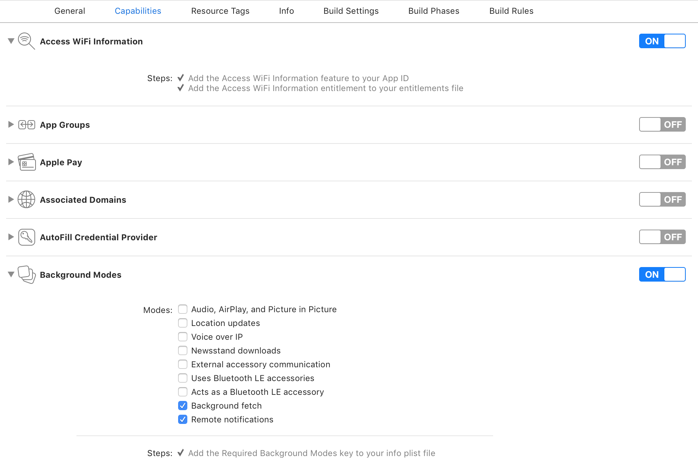

### Configure capabilities ###

Using XCode, configure the application capabilities:

 * click on your app target, then select `Capabilities`.
 * Turn on `Background Modes`
 * In Background Modes, enable `Background fetch` and `Remote Notifications`
 * Turn on `Access Wifi Information`
 

### Add code to your app delegate ###

The host application delegate must to forward several calls from the operating system to the SDK. 
These are all implemented in the template application and can be conveniently copied from there. 

Take a look into the sample application’s delegate code:

 * Swift [https://github.com/incoming-inc/ios-sdk/blob/master/Swift/PVNSampleSwift/AppDelegate.swift](https://github.com/incoming-inc/ios-sdk/blob/master/Swift/PVNSampleSwift/AppDelegate.swift)
 * Objective-C [https://github.com/incoming-inc/ios-sdk/blob/master/Objective-C/PVNTemplate/PVTAppDelegate.m](https://github.com/incoming-inc/ios-sdk/blob/master/Objective-C/PVNTemplate/PVTAppDelegate.m)

The minimum code to add to your application delegate is as follows. 

~~~~

	import UIKit
	import IncomingPVN

	@UIApplicationMain
	class AppDelegate: UIResponder, UIApplicationDelegate {

		var window: UIWindow?

		func application(application: UIApplication, didFinishLaunchingWithOptions launchOptions: [NSObject: AnyObject]?) -> Bool {

			// turn on debug logging
			ISDKAppDelegateHelper.setDebugLogging(true);

		    // ISDK method forward
		    ISDKAppDelegateHelper.application(application, didFinishLaunchingWithOptions:launchOptions)

		    // If using remote notification for background updates - call this method at some stage. 
			// this is only for remote notifications and will never prompt the user for notification permissions
		    ISDKAppDelegateHelper.registerForRemoteNotifications()

		    // the two following calls are optional. They enable location and motion data collection
		    // which improves the timing prediction of Push Video Notifications.
		    // Calling these methods may result in the OS permission dialog being presented
		    // to the user.
		    // ISDKAppDelegateHelper.registerForLocationUpdates()
		    // ISDKAppDelegateHelper.registerForMotionActivity()

		    // <insert your app initialization code here>
		    return true
		}

		func application(_ application: UIApplication, performFetchWithCompletionHandler completionHandler: @escaping (UIBackgroundFetchResult) -> Void) {
		    // ISDK method forward
			// You can also perform your own application's background fetch method, combine the UIBackgroundFetchResult as needed, 
			// and call the OS-supplied completion handler only once with the combined result. C.f. the objective-C example for 
			// an example of how to do that. 
		    ISDKAppDelegateHelper.application(application, performFetchWithCompletionHandler:completionHandler)
		}

		// only needed if using remote notifications
		func application(_ application: UIApplication, didRegisterForRemoteNotificationsWithDeviceToken deviceToken: Data) {
		    // ISDK method forward
		    ISDKAppDelegateHelper.application(application, didRegisterForRemoteNotificationsWithDeviceToken: deviceToken)
		}

		// only needed if using remote notifications
		func application(_ application: UIApplication, didFailToRegisterForRemoteNotificationsWithError error: Error) {
		    // ISDK method forward
		    ISDKAppDelegateHelper.application(application, didFailToRegisterForRemoteNotificationsWithError:error)
		}

		// only needed if using remote notifications
		func application(_ application: UIApplication, didReceiveRemoteNotification userInfo: [AnyHashable : Any], fetchCompletionHandler completionHandler: @escaping (UIBackgroundFetchResult) -> Void) {
		    // ISDK method forward
		    if ISDKAppDelegateHelper.application(application, didReceiveRemoteNotification: userInfo) == false
		    {
		        // process your app's remote notification here

		    }
		    completionHandler(.newData)
		}

		// only needed if using remote notifications
		func application(_ application: UIApplication, didReceiveRemoteNotification userInfo: [AnyHashable : Any]) {
		    // ISDK method forward
		    if ISDKAppDelegateHelper.application(application, didReceiveRemoteNotification: userInfo) == false
		    {
		        // process your app's remote notification here

		    }
		}
~~~~

#### Objective-C ####

~~~~
	#import "ISDKAppDelegateHelper.h"
	...

	- (BOOL)application:(UIApplication *)application didFinishLaunchingWithOptions:(NSDictionary *)launchOptions
	{
		// turn on debug logging 
		[ISDKAppDelegateHelper setDebugLogging:YES];
	
		[ISDKAppDelegateHelper application:[UIApplication sharedApplication] didFinishLaunchingWithOptions:launchOptions];
	
		// Set the UNUserNotificationCenterDelegate - iOS > 10
		if (NSClassFromString(@"UNUserNotificationCenter")) {
	        UNUserNotificationCenter *center = [UNUserNotificationCenter currentNotificationCenter];
	        center.delegate = self;
	    }

		// this registers for remote notifications on iOS > 8. It must be called
		// at some stage in your app initialization. Note that this method will never
		// result in a notification permission dialog being shown to the user. 
		[ISDKAppDelegateHelper registerForRemoteNotifications];

		// the two following calls are optional. They enable location and motion data collection
		// which improves the timing prediction of Push Video Notifications
		// calling these methods may also result in the OS permission dialog being presented
		// to the user.
		// [ISDKAppDelegateHelper registerForMotionActivity];
		// [ISDKAppDelegateHelper registerForLocationUpdates];

		return YES;
	}	

	- (void) application:(UIApplication *)application performFetchWithCompletionHandler:(void (^)(UIBackgroundFetchResult))completionHandler{

	    [ISDKAppDelegateHelper application:application performFetchWithCompletionHandler:^(UIBackgroundFetchResult isdkResult) {
	        // perform your app background fetch - and return result in appBackgroundFetchResult
	        UIBackgroundFetchResult appBackgroundFetchResult = ...;
    
	        if (appBackgroundFetchResult == UIBackgroundFetchResultFailed) {
	            completionHandler(UIBackgroundFetchResultFailed);
	            return;
	        }
    
	        if (isdkResult == UIBackgroundFetchResultNewData || appBackgroundFetchResult == UIBackgroundFetchResultNewData) {
	            completionHandler(UIBackgroundFetchResultNewData);
	            return;
	        }
    
	        completionHandler(appBackgroundFetchResult);
	    }];
	}

	// only needed if using remote notifications
	- (void)application:(UIApplication *)application didRegisterForRemoteNotificationsWithDeviceToken:(NSData *)deviceToken
	{
		[ISDKAppDelegateHelper application:application didRegisterForRemoteNotificationsWithDeviceToken:deviceToken];
	}

	// only needed if using remote notifications
	- (void)application:(UIApplication *)application didFailToRegisterForRemoteNotificationsWithError:(NSError *)error
	{
		[ISDKAppDelegateHelper application:application didFailToRegisterForRemoteNotificationsWithError:error];
	}

	// only needed if using remote notifications
	- (void)application:(UIApplication *)application didReceiveRemoteNotification:(NSDictionary *)userInfo
	        fetchCompletionHandler:(void (^)(UIBackgroundFetchResult))completionHandler
	{
	     if ([ISDKAppDelegateHelper application:application didReceiveRemoteNotification:userInfo fetchCompletionHandler:completionHandler] == NO)
	    {
	        // process your remote notification here.
	        completionHandler(UIBackgroundFetchResultNoData);
	    }
	}

	// only needed if using remote notifications
	- (void)application:(UIApplication *)application didReceiveRemoteNotification:(NSDictionary *)userInfo
	{
		[ISDKAppDelegateHelper application:application didReceiveRemoteNotification:userInfo];
	}
~~~~

	

Once done, you may want to proceed to the [SDK settings configuration](./sdk-settings.html)
