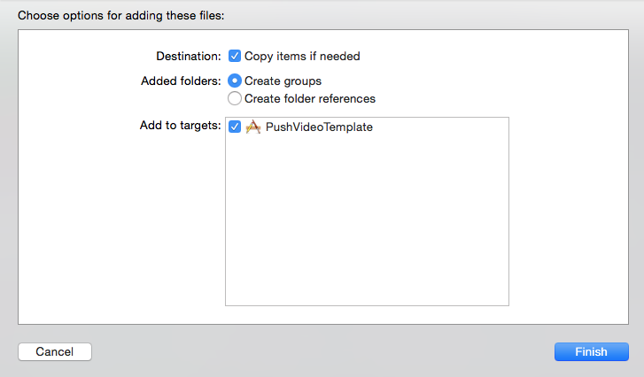
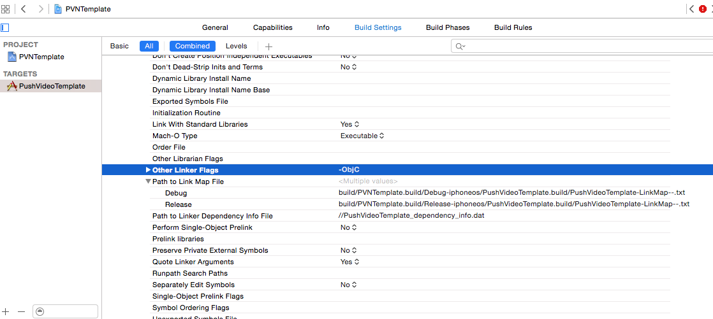

### Import the Incoming SDK zip ###

Contact your Incoming representative for access to the Incoming SDK distribution zip.

The distribution zip file contains a directory named incoming-ios-sdk, which itself contains:

* the Incoming SDK Framework
* the Incoming SDK Resource Bundle
* a sample configuration file sample-incoming-ios-sdk.plist
* README and CHANGELOG

To add the Incoming SDK to your project, drag and drop the incoming-ios-sdk onto your XCode project. Tick "Copy items if needed".

### Configure framework dependencies ###

(if your project is in Swift, you can skip this phase) 
Go into your app’s target’s Build Phases screen and add the following frameworks to
the *Link Binary With Libraries* section

	* AVFoundation.framework
	* MediaPlayer.framework
	* SystemConfiguration.framework
	* CoreMotion.framework
	* CoreTelephony.framework
	* CoreData.framework
	* CoreMedia.framework
	* MediaPlayer.framework
	* MobileCoreServices.framework
	* SystemConfiguration.framework
	* Foundation.framework
	* CoreImage.framework
	* Accelerate.framework
	* UIKit.framework
	* libz.dylib
	* NotificationCenter.framework

### Set linker flags ###

Enable a linker flag that allows the use of categories in the Incoming SDK static library. 
Start by choosing the main target for your app, selecting the Build Settings tab, and then
 search for `other linker flags`. Under Other Linker Flags, add the `-ObjC`.

### Add bridging header ###

If your project doesn't use swift, you may skip to the next step. Swift users must add [this 
bridging header](https://github.com/incoming-inc/ios-sdk/blob/master/Swift/ISDK-Bridging-Header.h) 
to their project to be able to use the Incoming SDK.

