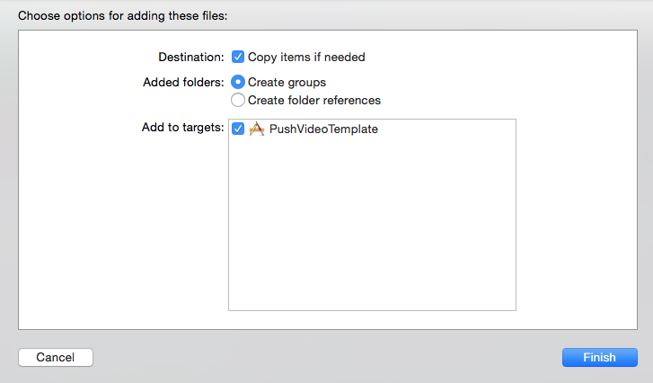

We provide a template application to make the SDK integration easy in a new project.

### Clone the Template Application ###

`git clone https://github.com/sourse-ai/ios-sdk`

### Import the SDK zip ###

Contact your Sourse representative for access to the Sourse SDK distribution zip.

The distribution zip file contains a directory named incoming-ios-sdk, which itself contains:

* the Sourse SDK Framework
* the Sourse SDK Resource Bundle
* a sample configuration file sample-incoming-ios-sdk.plist
* README and CHANGELOG

To add the Sourse SDK to your project, drag and drop the incoming-ios-sdk folder onto your XCode project. Tick "Copy items if needed".

Proceed to the [SDK settings configuration](./sdk-settings.html)

