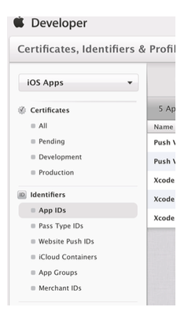
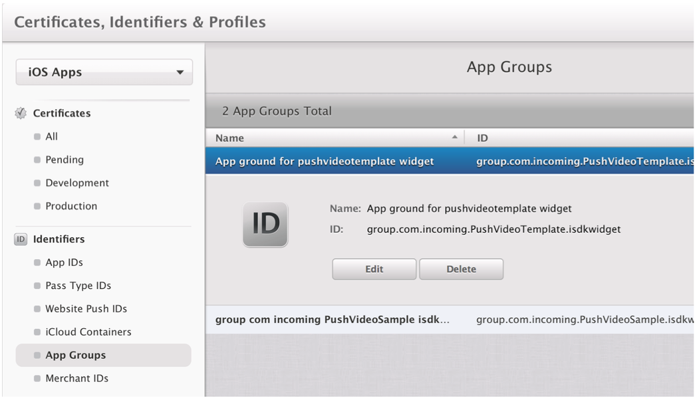
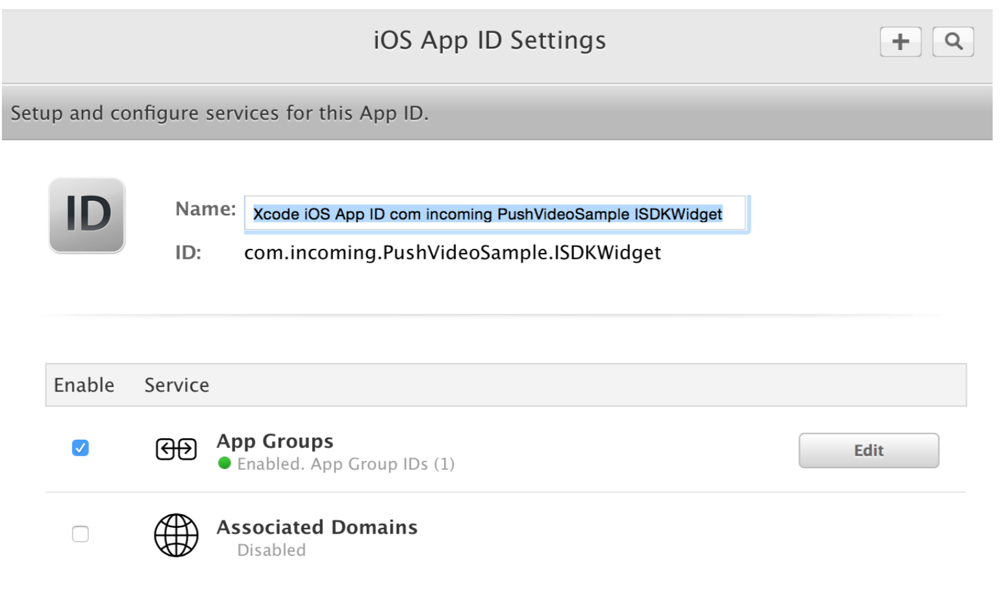
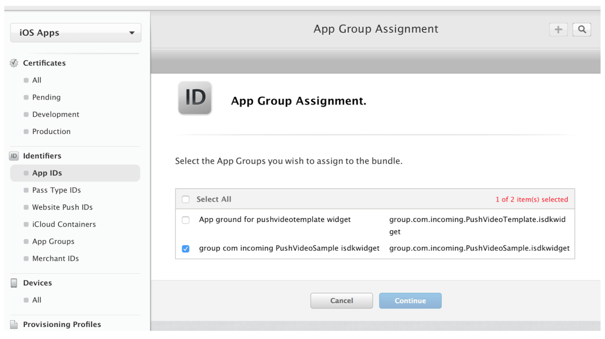
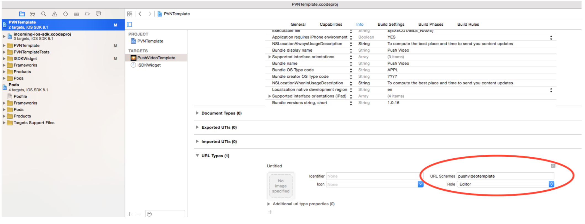
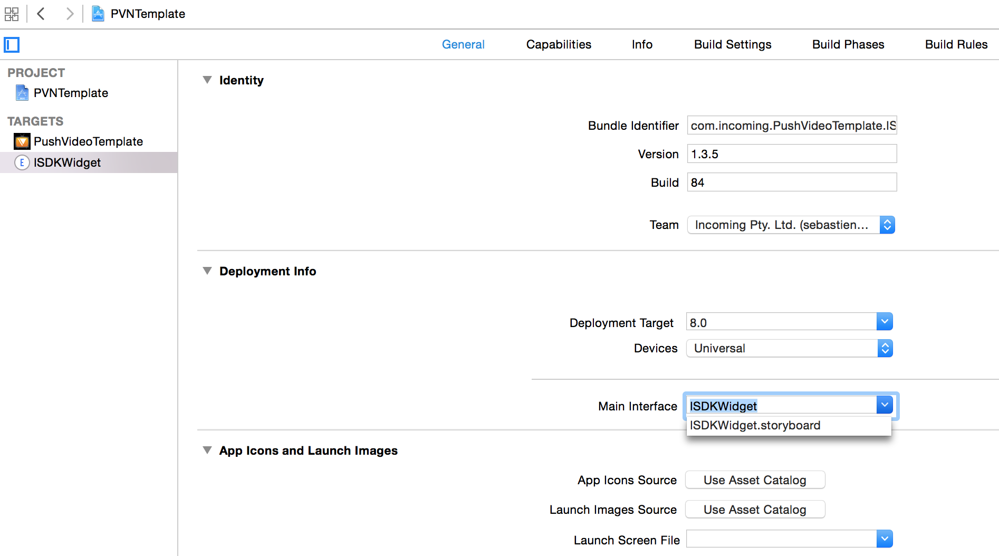

The Incoming PVN widget uses the app extensions features of iOS8, to display a video preview of last notified video, within the iOS Notification centre. When tapped, the widget opens your application and plays the PVN video. This document describes how to integrate the widget in your application. Download the widget supplementary archive from the Incoming Control panel, or speak to your Incoming representative. 

__Note__:

___The widget supplementary archive is supplied for evaluation purposes. To customize the user interface and user experience of the widget, speak to your Incoming representative.___


## Widget designs ##

There are two widget designs, large and compact which are shown below. 


The large widget is shown when the Notification center is shown in landscape mode, and the small one for portrait.

## Pre-requisites

You will need: 

* XCode 6 or above
* Access to the apple developer portal for your app ID
* Your app project, [configured to use the Incoming Push Video Notification SDK](./). 
* the _incoming-ios-sdk-widget-*.zip_ supplementary archive, available from the Incoming Control Panel


## Apple developer portal configuration ##

The widget is an iOS 8 app extension of the “Today View” type (c.f. [https://developer.apple.com/app­extensions/](https://developer.apple.com/app­extensions/))​.
Its code therefore reside in a separate target under your XCode project, with a separate Bundle ID (‘app id’). You must therefore configure two bundle ID in the apple developer portal: one for your application and one for the widget. In addition, the SDK and the widget must be part of the same apple app group, to be able to communicate and exchange data (c.f. the “Sharing Data with your Container app” section at [https://developer.apple.com/library/ios/documentation/General/Conceptual/ExtensibilityPG/Ext ensionScenarios.html](https://developer.apple.com/library/ios/documentation/General/Conceptual/ExtensibilityPG/Ext ensionScenarios.html)).


### Create the bundle IDs ###

Log in the Apple developer portal, and click __Certificates, Identifiers and Profiles__, then __Identifiers__ under __App Ids__.



Create two app IDs with the following structure:

 * `com.yourcompany.yourapp` (if not created already)
 * `com.yourcompany.yourapp.widget`

Note: The host application cannot use a wildcard app id (in the form com.yourcompany.*), as the Incoming Push Video Notification requires push notifications


### Create the app group ### 

The widget and host application use a shared filesystem area to communicate and exchange data. To enable this shared filesystem, the containing app's main target and the widget app IDs need to be part of the same "App Group".

To create the app group, still in the apple developer portal, click Identifiers / App Groups / +. Name it e.g. `group.com.yourcompany.yourapp` (Apple recommends that the group name should start with ‘group’). 
	



### Configure app IDs to use the app security group ###

In the Apple Developer portal, select “Identifiers” / "App IDs” and enable the App Group service for both app IDs previously created, by clicking the app ID, then ‘Edit’ at the bottom, then toggle the ‘App Groups’ service, click “edit” and select the app group created in the previous step.







### Re-generate provisioning profiles ###

Provisioning profiles must be re­generated so that the app group service is enabled when building your application. In the Apple Developer Portal, go to “Provisioning Profiles”,and generate a provisioning profile __for each app ID__.

## XCode project configuration

### Create the widget target

Create a new target for the widget, using File > New > Target > Application Extension > Today Extension


For the product name, enter e.g ‘widget’, which should automatically set the bundle ID to `com.yourcompany.yourapp.widget`. This bundle ID should match the app ID created previously in the Apple Developer Portal.

Note: You may want to have the widget's target bundle version number identical to the containing app bundle version number, or you may get a warning when submitting your app to iTunes connect.

### Configure the widget target Deployment Target

In XCode, click on the widget, the go to the "General" configuration tab. In the "Deployment Target" area, enter "8.0" (or higher if your app doesn't support 8.0) for the deployment target. 

### Configure the widget target Linker Flags

In XCode, click on the widget's target, then on the "Build Settings" tag. Search for 'Other Linker Flags' in the top right search box, and enter '-ObjC' for the 'Other Linker Flags' option.  


### Configure the app and widget target capabilities

In the XCode project navigator, select your project, then your application target, and select the Capability pane. Scroll down to “App Group”, and select the app group previously created in the Apple Developer Portal. If you don’t see your app group, click the reload button (next to the ‘+’ button). Repeat this step for the widget target. Both targets must be configured with the App Group capability.


### Configure the Incoming Push Notification SDK

This step ensures that the Incoming PVN SDK addresses the right widget. Edit the _incoming-­ios-­sdk.plist_ file in your project, and add these two entries:

 * `widget_bundle_id`​ set to your widget bundle id, e.g. com.yourcompany.yourapp.widget
 * `security_application_group`​ set to your group name, e.g. group.com.yourcompany.yourapp


### Configure target provisioning profiles

This step ensure that each target embeds the right provisioning profile. In both main app and widget target’s build settings, scroll down to the “Code Signing” and check that the “Provisioning Profile” setting is set to “Automatic”. Alternatively, select the provisioning profiles previously created in the Apple Developer Portal.

### Add an application launch URL scheme

When the widget is tapped, your host application is launched and plays the video shown on the widget. This is achieved using a custom URL scheme, which needs to be registered.
Note that this URL scheme is in addition to any other URL schema that your app may already be handling. For example if your app is handling a URL scheme `myproduct://`, you may want to add a new one called `myproduct­pvn://`

In XCode, select your app main target, then to the “Info” pane, scroll to the bottom to reveal the “URL types” section. In “URL Schema” add a the URL scheme. (You may want to refer to e.g. [http://appurl.org/](http://appurl.org/)​to check for the uniquess of your app url schemes). 



In addition, you need to add the URL to the _incoming­-ios-­sdk.plist_ file, in your main app’s target. The key is `app_url_scheme`, and the URL scheme should be entered without the ```://```, i.e. ```pushvideotest``` and not ```pushvideotest://```


### Add the Incoming widget library and assets to your project

Unzip the _incoming-ios-sdk-widget-*.zip_ supplementary archive. Add all the files to your project, adding them to widget target.

Set the widget target's main interface file, by clicking on your widget's target, then the 'General' tab, and the 'main interface' settings in the 'General' tab. 



Note: the widget is entirely implemented in the supplied framework and bundle. However, the target must contain at least one compilable source file so that the framework can be linked against something. 


### Edit the widget configuration file

Open the _incoming-widget.plist_ file, and replace the `security_application_group` entry with the security group previously defined in the Apple Developer portal, e.g. `group.com.yourcompany.yourapp`. In addition, edit the `app_url_scheme` key, and enter the url scheme defined in the ‘Add application launch URL scheme’ section above.


